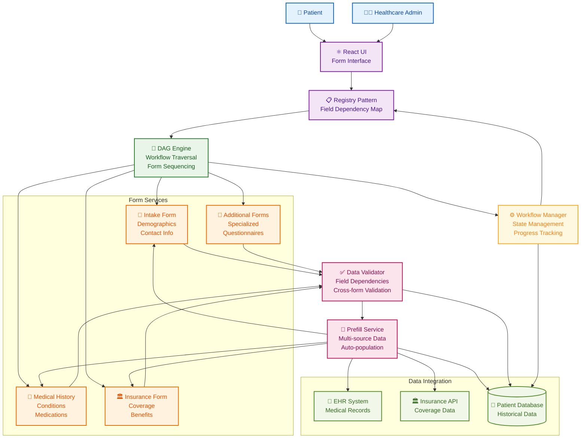
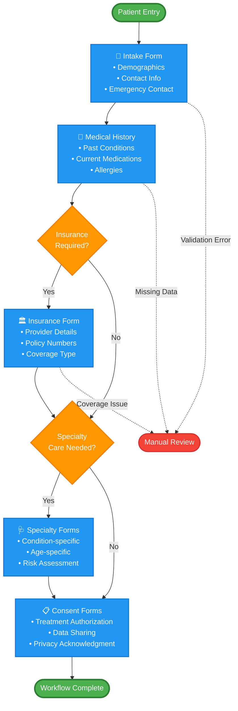
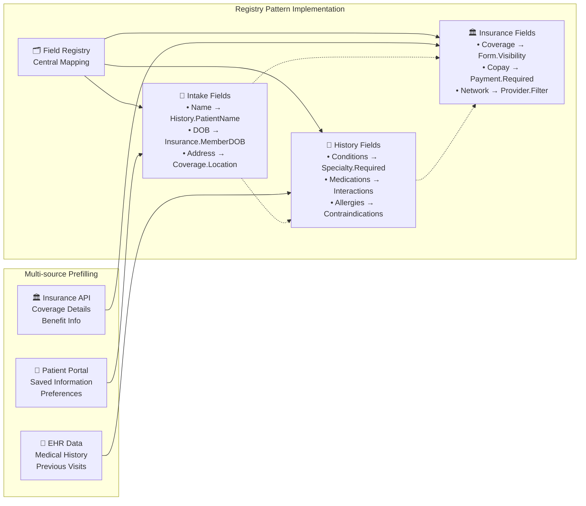

# Healthcare Form Workflow System

An intelligent patient data management platform using Directed Acyclic Graph (DAG) traversal for complex form workflows. Features dynamic field dependencies, multi-source data prefilling, and seamless patient journey orchestration across multiple healthcare forms.

## What It Does

**Patient Data Journey:**
1. **Patient Intake** → Initial registration and demographic information collection
2. **Medical History** → Comprehensive health background and condition tracking
3. **Insurance Processing** → Coverage verification and benefit management
4. **Dependency Management** → Smart field mapping and cross-form data validation
5. **Workflow Orchestration** → DAG-based form sequencing and conditional routing

## System Architecture

## DAG Workflow Structure

## Field Dependency Registry

## Tech Stack

**Frontend:** React.js, JavaScript ES6+, CSS3, Responsive Design  
**Architecture Patterns:** Registry Pattern, DAG Traversal, State Management  
**Data Processing:** Field Dependency Mapping, Multi-source Prefilling  
**Integration:** EHR Systems, Insurance APIs, Patient Databases  
**Workflow:** Directed Acyclic Graph, Conditional Form Routing

## Key Features

- 🌊 **DAG Workflow Engine** - Intelligent form sequencing using directed acyclic graph traversal
- 📋 **Registry Pattern** - Centralized field dependency mapping across 6+ healthcare forms
- 🔄 **Multi-source Prefilling** - Automated data population from EHR, insurance, and patient systems
- ✅ **Cross-form Validation** - Real-time dependency checking and data consistency
- 🎯 **Conditional Routing** - Dynamic form progression based on patient responses
- 📊 **Progress Tracking** - Visual workflow status and completion indicators
- 🏥 **Healthcare Compliance** - HIPAA-compliant data handling and privacy controls
- ⚡ **Performance Optimization** - Efficient form rendering and data processing

## Form Dependencies

| Source Form | Target Form | Dependency Type | Field Mapping |
|-------------|-------------|-----------------|---------------|
| Intake | Medical History | Patient Name | `intake.fullName → history.patientName` |
| Intake | Insurance | Demographics | `intake.dob → insurance.memberDOB` |
| Medical History | Specialty Forms | Conditions | `history.conditions → specialty.required` |
| Insurance | All Forms | Coverage | `insurance.coverage → form.visibility` |
| Medical History | Insurance | Risk Assessment | `history.conditions → insurance.riskLevel` |

---
**Intelligent healthcare workflow system with advanced form dependency management and DAG-based patient journey orchestration**
